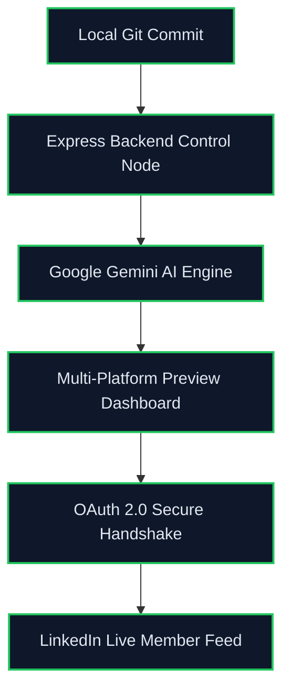

# DevFly

DevFly is an intelligent full-stack developer ecosystem that turns open-source commit history into polished, AI-crafted LinkedIn updates through a secure Gemini-powered pipeline.

---

## Architecture Mapping

DevFly is intentionally decoupled:

- `/devpost` is the React frontend client. It delivers an "Obsidian Industrial" dark theme experience built with Framer Motion animations, Tailwind-driven styling, and a polished preview dashboard for developer content flows.
- `/backend` is a Node.js + Express service. It handles OAuth 2.0 handshake flows, LinkedIn token lifecycle management, secure API routing, and request orchestration for Google Gemini AI generation.

The frontend and backend communicate across a controlled local development boundary: the Vite client on `http://localhost:5173` and the Express API on `http://localhost:5000`.

---

## System Flow Graph



---

## Developer Cheat Sheet

### Authentication Configuration Matrix

| Variable | Expected Format | System Purpose |
|---|---|---|
| `PORT` | `5000` or any available integer | Backend listener port for Express APIs |
| `GEMINI_API_KEY` | `sk-...` or other Gemini service token | Gemini AI engine authentication |
| `LINKEDIN_CLIENT_ID` | LinkedIn app client ID string | OAuth client identifier for LinkedIn |
| `LINKEDIN_CLIENT_SECRET` | LinkedIn app client secret | OAuth secret used during token exchange |
| `LINKEDIN_REDIRECT_URI` | `http://localhost:5000/api/auth/callback/linkedin` | Registered callback URL for LinkedIn OAuth |

### Backend Routing Reference

| Endpoint | Method | Request Payload | System Objective |
|---|---|---|---|
| `GET /api/auth/connect/linkedin` | GET | none | Start LinkedIn OAuth authorization flow |
| `GET /api/auth/callback/linkedin` | GET | `code` query param from LinkedIn | Exchange authorization code for access token and persist session cookie |
| `POST /api/ai/generate-drafts` | POST | `{ repo_name, commit_message, commit_sha }` | Send commit metadata to Gemini and return platform-specific draft copy |
| `GET /api/github/repos` | GET | none | Fetch authenticated user repositories from GitHub |
| `GET /api/github/repos/:repo_name/commits` | GET | none | Read commit history for a selected GitHub repository |

> Note: The current implementation routes AI draft generation through `POST /api/ai/generate-drafts`. LinkedIn publish integration is anchored by the OAuth token lifecycle and the client-side token cookie flow.

---

## Local Setup & Deployment Sequence

### 1. Clone the repository

```bash
git clone <repository-url> DevFly
cd DevFly
```

### 2. Backend configuration

Create a `.env` file inside `/backend` with the following values:

```env
PORT=5000
GEMINI_API_KEY=
LINKEDIN_CLIENT_ID=
LINKEDIN_CLIENT_SECRET=
LINKEDIN_REDIRECT_URI=http://localhost:5000/api/auth/callback/linkedin
```

### 3. Install dependencies

```bash
cd backend
npm install

cd ../devpost
npm install
```

### 4. Start the backend server first

```bash
cd backend
npm run dev
```

### 5. Start the frontend client

```bash
cd ../devpost
npm run dev
```

### 6. Access the app

- Frontend: `http://localhost:5173`
- Backend health check: `http://localhost:5000/api/health`

---

## Security Protocol

DevFly enforces strict API credential isolation via the root `.gitignore`:

- `.env` files are ignored
- local Node modules and build artifacts are ignored
- debug logs and OS artifacts are ignored

This ensures API keys, OAuth secrets, and session tokens stay out of source control and are only loaded at runtime from local environment variables.

---

## Notes

- The `/devpost` frontend is optimized for an immersive developer dashboard experience with Framer Motion transitions, dark UI surfaces, and responsive routing between login, connective auth, and dashboard screens.
- The `/backend` service orchestrates secure OAuth handshakes, GitHub commit extraction, and Gemini AI generation, making DevFly a developer-centric workflow for automated social presence.
